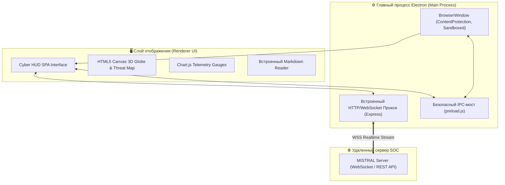

# 💻 MISTRAL Defense — SOC Operator Command Center (Client)

<div align="center">


**Кроссплатформенное десктопное приложение оператора центра мониторинга и реагирования на инциденты безопасности (SOC / Blue Team Command Center).**

[Обзор](#-обзор) • [Архитектура](#-архитектура-клиента) • [Ключевые модули](#-ключевые-модули-интерфейса) • [Безопасность клиента](#-безопасность-клиентского-контура) • [Быстрый старт](#-быстрый-старт) • [Сборка](#-сборка-дистрибутива)

</div>

---

## 📌 Обзор

**MISTRAL Defense Client** — это специализированное рабочее место аналитика информационной безопасности (SOC Analyst HUD). Приложение предоставляет оператору исчерпывающий инструментарий для наблюдения за инфраструктурой в реальном времени, визуализации географии атак, управления блокировками брандмауэра, взаимодействия с AI-ассистентом и изоляции скомпрометированных сервисов.

Приложение спроектировано в виде автономного **Portable EXE**, не требующего предварительной установки Node.js, компиляторов или зависимостей на целевом рабочем компьютере.

---

## 🏗️ Архитектура клиента

Приложение построено на базе двухпроцессной модели **Electron** с полной изоляцией контекстов и локальным микросервером:



---

## 🌟 Ключевые модули интерфейса

### 1. 🌍 3D Кибер-карта и визуализация атак (Threat Map)
- **Интерактивный глобус и проекция карты**: отрисовка векторов атак на базе HTML5 Canvas и D3.js.
- **GeoIP-трассировка**: автоматическая визуализация дуги атаки от координат злоумышленника (с определением страны, города и интернет-провайдера) к защищаемому дата-центру.
- **Цветовая градация опасности**: динамическая подсветка траекторий в зависимости от степени критичности инцидента (`CRITICAL` — ярко-красный, `HIGH` — оранжевый, `MEDIUM` — желтый).

### 2. 📊 Дашборд телеметрии и индикатор рисков (Risk Gauge)
- **Сенсоры реального времени**: мониторинг загрузки процессора (CPU), оперативной памяти (RAM), дисковой подсистемы и трафика хоста через потоковые WebSocket-события.
- **Метрики сетевых аномалий**: синхронизация счетчиков TCP SYN-Flood, аномальных портов и попыток брутфорса из модуля `monitor_network`.
- **Звуковая сигнализация (Web Audio API)**: генерация звуковых предупреждений при поступлении угроз повышенного уровня важности.

### 3. 🚨 Инцидент-менеджер и карантин
- **Таблица инцидентов**: фильтрация по severity, типам векторов (SQLi, Command Injection, DDoS, Ransomware), статусам и временным диапазонам.
- **Управление карантином хостов**:
  - Быстрая блокировка/разблокировка подозрительных IP в брандмауэре Linux (UFW) в один клик.
  - Защита оператора от случайной блокировки доверенных системных адресов и активных сессий администратора.

### 4. 🛡️ Управление списком исключений (IP Whitelist GUI)
- Интерактивный визуальный менеджер неблокируемых адресов:
  - 🟢 `[SSH Session]` — автоматически обнаруженные открытые сессии администратора.
  - ⚪ `[Default]` — системные адреса локальной петли (`127.0.0.1`, loopback).
  - 🔵 `[CIDR / Custom]` — добавленные корпоративные подсети и доверенные IP с возможностью мгновенного удаления.
- Подсветка защищенных адресов в журнале логов значком щита `192.168.1.50 🛡️`.

### 5. 🧠 AI-Аналитик и встроенный Markdown Reader
- **Интерактивный диалог с ИИ**: подключение к языковым моделям (DeepSeek, Claude, Kimi) для разбора вектора атаки и оценки ущерба.
- **Шаблоны митигации**: автоматическая генерация скриптов устранения последствий инцидента с интерактивными кнопками выполнения.
- **Архив отчетов (.md)**: полноценный встроенный просмотрщик детальных аналитических Markdown-отчетов, сформированных сервером при расследованиях.

### 6. 🐳 Удаленное управление контейнерами (Docker SOAR)
- Мониторинг запущенных сервисов защищаемой системы.
- Дистанционный запуск, остановка и перезапуск скомпрометированных Docker-контейнеров прямо из интерфейса оператора через защищенный сокет.

---

## 🔒 Безопасность клиентского контура

При разработке интерфейса оператора реализованы жесткие требования кибергигиены:

1. **Context Isolation & Sandboxing**: рендерер Electron изолирован от прямого вызова системных функций Node.js. Все вызовы строго ограничены через `preload.js` с использованием контекстного моста (`contextBridge`).
2. **Защита от утечки экрана (`setContentProtection`)**: включен системный флаг операционной системы, предотвращающий захват окна приложения сторонними утилитами создания скриншотов и программами удаленного наблюдения.
3. **Защита от XSS и Clickjacking**: отключена возможность произвольной навигации внутри окна (`will-navigate` lockdown), заголовки безопасности усилены политиками CSP.

---

## 📁 Структура проекта

```text
Mistral Сlient/
├── dist/                                  # Готовые сборки приложения
│   └── MISTRAL-Defense-Portable-1.3.1.exe # Портативный исполняемый файл для Windows
│
├── src/                                   # Исходный код приложения
│   ├── main.js                            # Главный процесс Electron, управление окном и прокси
│   ├── preload.js                         # Безопасный IPC-мост (Context Bridge)
│   ├── client-server.js                   # Локальный прокси-сервер Express/WS
│   │
│   ├── templates/                         # HTML-разметка интерфейса
│   │   └── index.html                     # Главное окно оператора (Cyber HUD SPA)
│   │
│   └── static/                            # Статические ресурсы интерфейса
│       ├── totem.ico                      # Фирменная иконка приложения
│       ├── css/
│       │   └── main.css                   # Стилистика темной темы (Glassmorphism & Neon)
│       └── js/
│           ├── core.js                    # WebSocket-подключение, управление состоянием
│           ├── ui.js                      # Таблицы, графики, модальные окна, экспорт отчетов
│           ├── ai.js                      # Чат с нейросетью и применение рекомендаций
│           └── cyber-map.js               # 3D глобус и рендеринг карты атак на Canvas
│
├── package.json                           # Конфигурация electron-builder и зависимости
├── LICENSE.txt                            # Текст лицензии
└── start.bat                              # Скрипт быстрого запуска для Windows
```

---

## 🚀 Быстрый старт

### Вариант 1. Запуск готового Portable EXE (Без установки)
1. Перейдите в каталог `dist/` или в раздел **Releases** на GitHub.
2. Запустите файл **`MISTRAL-Defense-Portable-1.3.1.exe`**.
3. В окне входа укажите адрес вашего сервера `MISTRAL Server` (по умолчанию: `http://localhost:8080`) и учетные данные оператора.
4. Готово! Приложение подключится по WebSocket и начнет получать телеметрию.

### Вариант 2. Запуск из исходного кода (Для разработки)

```bash
# Клонирование репозитория
git clone https://github.com/yousioks/Mistral_Client.git
cd Mistral_Client

# Установка зависимостей
npm install

# Запуск в режиме разработки
npm run dev
```

Для Windows также доступен готовый командный файл:
```cmd
start.bat
```

---

## 📦 Сборка дистрибутива

Сборка портативного или установочного исполняемого файла выполняется с помощью `electron-builder`:

```bash
# Сборка переносимой версии (Portable EXE)
npm run build:portable

# Сборка стандартного NSIS-инсталлятора
npm run build:win
```

Результат сборки сохраняется в каталоге `dist/`.

---

## 📄 Лицензия

Проект распространяется под лицензией [MIT](LICENSE.txt).
