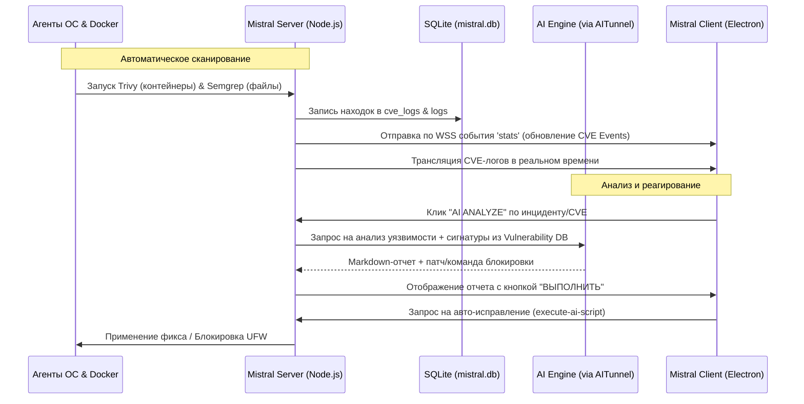

# Анализ архитектуры MISTRAL Defense & Remon и предложения по улучшению

Данный документ содержит детальный разбор структуры проекта, принципов работы его модулей, логики автоматического сканирования уязвимостей (Trivy, Semgrep) и предложения по дальнейшему развитию системы.

---

## 1. Архитектурная структура проекта

Проект представляет собой распределенную SOAR/XDR/SIEM/WAF-систему, состоящую из четырех основных компонентов:

1. **Remon (Целевой веб-стенд)**:
   * **Технологии**: Next.js + Express.js + PostgreSQL/SQLite.
   * **Назначение**: Реалистичная эмуляция корпоративного веб-ресурса (строительно-девелоперской компании) с преднамеренно заложенными уязвимостями (SQL-инъекции, обход авторизации, хранимые XSS).
   * **Защитный контур**: Развернут за прокси-сервером Nginx с модулем **Lua WAF (OpenResty)**. WAF инспектирует HTTP-запросы на сигнатуры атак, блокирует вредоносный трафик и отправляет сообщения об атаках на сервер MISTRAL через REST API (`/api/attack-detected`).

2. **Mistral Server (Ядро безопасности)**:
   * **Технологии**: Node.js (Express, `ws`), SQLite (`better-sqlite3`), системные утилиты Linux (UFW, iptables).
   * **Назначение**: Центральный сервер сбора телеметрии и реагирования.
   * **Функции**:
     * Обработка логов и метрик от ОС и WAF.
     * Расчет уровня угрозы хоста (индекс DEFCON).
     * Управление политиками автоматической блокировки (SOAR) в брандмауэре UFW/iptables.
     * Интеграция с Telegram-ботом для оперативного информирования SOC-инженеров.
     * Интеграция с LLM (DeepSeek, Kimi, Claude) через AITunnel для интеллектуального анализа инцидентов и автогенерации скриптов митигации.
     * Управление фоновыми аудитами безопасности (Semgrep, Trivy).

3. **Mistral Client (SOC-Терминал оператора)**:
   * **Технологии**: Electron.js, Vanilla HTML/CSS/JS, Chart.js, HTML5 Canvas.
   * **Назначение**: Панель мониторинга SOC-оператора в реальном времени.
   * **Интерфейс**: Стилизован под темный неоново-красный HUD с применением эффектов Glassmorphism. Включает интерактивную карту атак (Threat Map) с GeoIP-визуализацией, 3D-глобус киберугроз, матрицу MITRE ATT&CK, терминал сканирования уязвимостей, лог-панель с быстрым баном IP и чат-интерфейс ИИ-ассистента.

4. **Mistral Demo (Attack Simulator)**:
   * **Технологии**: Python-скрипты.
   * **Назначение**: Имитатор многовекторных атак (DDoS/HTTP Flood, Brute Force на SSH, Port Scanning, SQL-инъекции) для демонстрации эффективности работы защитных механизмов.

---

## 2. Логика автоматического сканирования и детекции CVE

Внедренная концепция **жестко автоматизированной системной связки** подразумевает отсутствие необходимости ручного запуска сканеров Trivy и Semgrep. При развертывании Mistral Server:

1. **Автозапуск сканеров**:
   * В фоновом режиме запускается циклическая служба или скрипт (например, `install_audit.sh` / `install_semgrep_trivy.sh` и триггеры крона), которые выполняют сканирование.
   * **Trivy** производит аудит Docker-контейнеров (образов) и системных файлов хоста (`/etc` и критические директории).
   * **Semgrep** проводит статический анализ исходного кода веб-сервисов на наличие небезопасных конструкций.

2. **Обработка результатов**:
   * Результаты сканирования в формате JSON анализируются сервером.
   * Найденные уязвимости (CVE, небезопасный код) преобразуются в записи БД SQLite в таблицу `cve_logs` с помощью метода `addCveLog(entry)`.

3. **Передача и отображение в Mistral Client**:
   * При фиксации новых уязвимостей сервер отправляет событие по WebSocket (`stats`, `logs_list` с типом `cve`).
   * В Mistral Client на дашборде обновляется счетчик **"CVE Events"** (`s-vuln`).
   * Вкладка логов при выборе фильтра **"CVE"** отображает подробные сведения об обнаруженных уязвимостях.
   * ИИ-ассистент в клиенте генерирует рекомендации (решения) по исправлению уязвимостей (например, обновление npm-пакетов, изменение конфигурации Nginx).

---

## 3. Карты и потоки данных (Data Flows)

---

## 4. Предложения по улучшению проекта (Идеи для расширения)

Для повышения уровня автономности и качества защиты системы MISTRAL предлагаются следующие технические решения:

### 4.1. Автоматическая изоляция скомпрометированных контейнеров (Docker SOAR)
* **Проблема**: При обнаружении критической CVE (CVSS 9.0+) в запущенном Docker-контейнере злоумышленник может проэксплуатировать ее до того, как оператор примет меры.
* **Решение**: Добавить в SOAR-настройки опцию **"Auto-Quarantine Docker Containers"**. При обнаружении критической уязвимости в контейнере через Trivy, Mistral Server автоматически выполняет:
  * Остановку контейнера или перенаправление входящего трафика на резервный "чистый" экземпляр.
  * Помещение контейнера в изолированную сетевую подсеть Docker (без доступа к интернету и базам данных) для расследования.

### 4.2. Корреляция CVE и статического анализа (Vulnerability Validation)
* **Проблема**: Trivy часто находит сотни уязвимостей в библиотеках, но многие из них не используются кодом приложения (ложные срабатывания).
* **Решение**: Добавить интеллектуальный фильтр с помощью ИИ. Сервер сопоставляет находки Trivy (уязвимые функции библиотек) и выводы Semgrep (фактическое использование данных функций в коде).
  * Если уязвимая функция вызывается в коде — повышать критичность инцидента до `CRITICAL` и включать авто-защиту.
  * Если вызова нет — присваивать статус `MEDIUM (Unreachable)`.

### 4.3. Виртуальный патчинг (Virtual Patching) в Lua WAF
* **Проблема**: Обновление пакетов и пересборка контейнеров занимает время (от часов до дней).
* **Решение**: Использовать интеграцию WAF и результатов Trivy. Если Trivy обнаруживает уязвимость (например, CVE-2021-44228 Log4j), сервер генерирует патч для Lua WAF, который блокирует специфичные сигнатуры эксплойта на лету. 
  * Это дает временное окно ("виртуальный патч") для безопасного обновления ПО разработчиками.

### 4.4. Замена классических лог-файлов на eBPF / Auditd телеметрию
* **Проблема**: Парсинг логов `/var/log/auth.log` или файлов Docker-демона создает накладные расходы и может быть обойден злоумышленником, если тот получит права root и очистит журналы.
* **Решение**: Перевести локальные Lua-мониторы на eBPF-зонды (или утилиту `auditd`). eBPF перехватывает системные вызовы на уровне ядра Linux (например, `execve` для запуска процессов, `connect` для сети). 
  * Это делает мониторинг абсолютно защищенным от удаления и мгновенным (микросекундный отклик).

### 4.5. Визуализация сетевой топологии Docker в реальном времени
* **Проблема**: Вкладка "Threats" и 3D-глобус отображают только внешние атаки по GeoIP. Контейнерная инфраструктура скрыта.
* **Решение**: Добавить интерактивный граф сетевых связей Docker-контейнеров на Canvas. 
  * Контейнеры отображаются в виде узлов.
  * Узлы с обнаруженными CVE подсвечиваются пульсирующим красным/желтым цветом.
  * При атаке отображается анимация прохождения трафика между контейнерами, что позволяет локализовать латеральное движение (Lateral Movement) злоумышленника внутри сети.

### 4.6. Механизм Continuous AI Auto-Tuning
* **Проблема**: Шаблоны блокировок и сигнатуры могут приводить к ложным срабатываниям (False Positives).
* **Решение**: Обучение ИИ-агента на обратной связи от оператора. Если оператор отменяет бан IP (кнопка `UNBAN IP`) или меняет статус инцидента на "ложный", сервер добавляет это событие в локальный файл `data/ai_feedback_loops.json`, который автоматически подмешивается в контекст промпта ИИ при последующих анализах.
