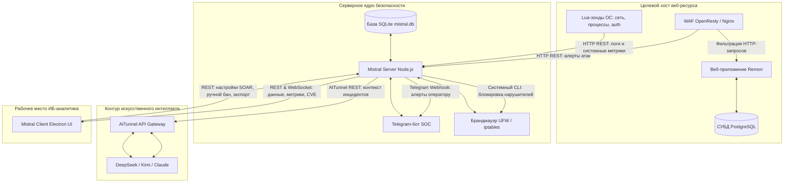

# Архитектурная структура и описание компонентов MISTRAL SOC & Remon

Этот документ содержит исчерпывающее техническое описание структуры распределенного программного комплекса мониторинга, анализа и автоматического реагирования на инциденты информационной безопасности **MISTRAL SOC** в связке с тестируемым уязвимым веб-сервисом **Remon**.

---

## 1. Компонентный состав и файловая структура проекта

Проект разбит на четыре ключевые программные зоны, организованные в виде Git-репозиториев и субмодулей:

```
Диплом/
├── Remon/                          # Тестируемый веб-стенд (Next.js + OpenResty WAF)
├── Mistral Server/                 # Центральный сервер SOC и мониторинга (Node.js)
├── Mistral Client/                 # Клиентское Desktop-приложение оператора (Electron)
├── Mistral Demo/                   # Генератор/симулятор многовекторных кибератак (Python)
├── defense_additions.md            # Руководство по механизмам защиты и слайды для ВКР
└── mistral_structure_analysis.md   # [Данный файл] Описание архитектуры и структуры
```

### A. Remon — Целевой веб-стенд
Имитирует информационную систему строительной компании с заложенными уязвимостями (SQLi, XSS, IDOR) для демонстрации работы средств обнаружения и блокировки атак.

* **Ключевые директории и файлы**:
  * [docker-compose.yml](file:///c:/Users/omskp/OneDrive/Рабочий%20стол/Диплом/Remon/docker-compose.yml) — Конфигурация оркестрации контейнеров (Next.js-фронтенд, Express-бэкенд, PostgreSQL, OpenResty WAF).
  * `backend/` — REST API бэкенд на Node.js (работа с СУБД, уязвимые маршруты).
  * `frontend/` — Веб-интерфейс пользователя на Next.js.
  * `nginx/nginx.conf` — Конфигурация Nginx в OpenResty. Содержит встроенные правила фильтрации на языке Lua, перехватывающие SQLi/XSS запросы и отправляющие алерты на Mistral Server (`POST /api/attack-detected`).
  * `init.sql` — Скрипт инициализации тестовой БД с демонстрационными записями.
  * `reset-db.sh` — Скрипт быстрого сброса базы данных к исходному состоянию.

### B. Mistral Server — Ядро безопасности SOC
Служит центром сбора логов (SIEM), принятия решений по блокировке (SOAR) и интеллектуального анализа инцидентов (ИИ-контур).

* **Ключевые директории и файлы**:
  * [src/server.js](file:///c:/Users/omskp/OneDrive/Рабочий%20стол/Диплом/Mistral%20Server/src/server.js) — Главный файл сервера. Инициализирует REST API, WebSocket-сервер, обрабатывает алерты WAF и ОС, управляет интеграцией с LLM через AITunnel и брандмауэром UFW.
  * [src/db.js](file:///c:/Users/omskp/OneDrive/Рабочий%20стол/Диплом/Mistral%20Server/src/db.js) — Слой хранения данных на базе SQLite (`better-sqlite3`). Управляет логами, инцидентами, базой уязвимостей (CVE) и белыми списками.
  * [src/telegram-bot.js](file:///c:/Users/omskp/OneDrive/Рабочий%20стол/Диплом/Mistral%20Server/src/telegram-bot.js) — Бот оперативного оповещения SOC-инженеров с интерактивными кнопками («🧠 АНАЛИЗ ИИ»).
  * [src/log_forwarder.js](file:///c:/Users/omskp/OneDrive/Рабочий%20стол/Диплом/Mistral%20Server/src/log_forwarder.js) — Модуль парсинга системной телеметрии.
  * [src/scanners.js](file:///c:/Users/omskp/OneDrive/Рабочий%20стол/Диплом/Mistral%20Server/src/scanners.js) — Спецификация автоматического запуска сканеров безопасности.
  * `monitors/` — Системные Lua-зонды для непрерывного аудита хоста (запускаются через `run-monitors.sh`):
    * `monitor_system.lua` — Поиск несанкционированных процессов по белому списку `process_whitelist.txt`.
    * `monitor_network.lua` — Сбор сетевой телеметрии, выявление аномальной активности портов.
    * `monitor_auth.lua` — Мониторинг попыток SSH-авторизации (`/var/log/auth.log`).
    * `monitor_integrity.lua` — Контроль целостности файлов конфигурации.
    * `monitor_sec_tools.lua` — Проверка статуса средств защиты ОС.

### C. Mistral Client — Панель оператора SOC (Electron)
Рабочее место администратора ИБ. Отображает состояние защищаемого контура в реальном времени.

* **Ключевые директории и файлы**:
  * [src/main.js](file:///c:/Users/omskp/OneDrive/Рабочий%20стол/Диплом/Mistral%20Сlient/src/main.js) — Точка входа Electron. Отвечает за IPC-мост, WSS-сессии, а также запускает локальный Express-сервер для проксирования REST API.
  * [src/preload.js](file:///c:/Users/omskp/OneDrive/Рабочий%20стол/Диплом/Mistral%20Сlient/src/preload.js) — Прослойка безопасности. Прокидывает API Electron (`electronAPI`) в контекст веб-страницы.
  * [src/templates/index.html](file:///c:/Users/omskp/OneDrive/Рабочий%20стол/Диплом/Mistral%20Сlient/src/templates/index.html) — Единый HTML-макет интерфейса со вкладками Dashboard, Incidents, Logs, Cyber Map, Vulnerabilities, Hardening, Settings.
  * `src/static/js/` — Файлы логики интерфейса:
    * [core.js](file:///c:/Users/omskp/OneDrive/Рабочий%20стол/Диплом/Mistral%20Сlient/src/static/js/core.js) — Инициализация WebSocket, обработка входящих алертов, логика запуска автономной ИИ-защиты, сохранение настроек SOAR.
    * [ui.js](file:///c:/Users/omskp/OneDrive/Рабочий%20стол/Диплом/Mistral%20Сlient/src/static/js/ui.js) — Обработка DOM-событий, рендеринг списков, графиков (Chart.js), экспорт отчетов и управление всплывающими окнами (модальными окнами, Drawer-панелями).
    * [ai.js](file:///c:/Users/omskp/OneDrive/Рабочий%20стол/Диплом/Mistral%20Сlient/src/static/js/ai.js) — Чат-интерфейс ИИ-ассистента, рендеринг шагов выполнения анализа инцидентов.
    * [cyber-map.js](file:///c:/Users/omskp/OneDrive/Рабочий%20стол/Диплом/Mistral%20Сlient/src/static/js/cyber-map.js) — Рендеринг интерактивного графа контейнерной сети Docker и 3D-глобуса киберугроз на HTML5 Canvas.

### D. Mistral Demo — Симулятор кибератак
Скрипт на Python, используемый для наглядной демонстрации работы комплекса.

* **Ключевые файлы**:
  * [attack_simulator.py](file:///c:/Users/omskp/OneDrive/Рабочий%20стол/Диплом/Mistral%20Demo/attack_simulator.py) — Скрипт-меню. Позволяет запустить DDoS-шторм, брутфорс SSH-порта (включая успешный вход), SQL-инъекции на веб-сервис Remon, запуск неизвестного процесса, сканирование портов или внедрение Ransomware.

---

## 2. Логика сквозных данных и контуров защиты

### A. SIEM-контур (Сбор и агрегация телеметрии)
1. Lua-зонды в фоне считывают системные файлы хоста, процессы и сетевые сокеты.
2. OpenResty WAF инспектирует HTTP-запросы к Remon.
3. Логи и события отправляются на Mistral Server через HTTP-запросы `POST /api/logs` или `POST /api/attack-detected`.
4. Сервер парсит сообщения, записывает их в SQLite базу данных (`logs`, `cve_logs`) и пересчитывает индекс DEFCON (общий уровень угрозы).
5. Результаты транслируются по WebSocket в Mistral Client, где обновляются дашборды, графики и таблицы в реальном времени.

### B. SOAR-контур (Реагирование и брандмауэр)
1. При наступлении атаки (например, DDoS-флуд или множественные неудачные попытки входа), сервер принимает решение о блокировке IP.
2. Проверяется белый список (`window.soarSettings.whitelist` и маски подсетей CIDR), а также активные SSH-сессии администратора, которые защищены от lockout.
3. Если IP не является системным или доверенным, выполняется вызов утилиты UFW (`sudo ufw insert 1 deny from [IP]`) через `iptables`.
4. Информация об успешной блокировке отправляется клиенту для отображения плашки «BAN IP» и записи в журнал.

### C. LLM-контур (ИИ-Защита)
1. При критических инцидентах или ручном клике оператора «AI ANALYZE», контекст угрозы отправляется в LLM через AITunnel.
2. ИИ-агент возвращает структурированный отчет и скрипт нейтрализации.
3. Если в настройках включен автономный режим, скрипт применяется сервером в ОС автоматически. Если выключен — выдается подробный гайд для оператора.

---

## 3. Новые технические решения и улучшения (Версия 1.4.0)

В рамках последних этапов разработки были внедрены следующие критически важные модули:

1. **Мониторинг физических и сетевых параметров хоста (Metrics Extended)**:
   * На бэкенде в `getHostMetrics` ([server.js](file:///c:/Users/omskp/OneDrive/Рабочий%20стол/Диплом/Mistral%20Server/src/server.js)) интегрирован сбор температуры CPU (`temp`) и количества активных сетевых соединений (`connections`).
   * На фронтенде добавлены графические карты `TEMP` и `CONNS` с адаптивной пятиколоночной версткой.
2. **Гибкая выборка и управление триггерами запуска ИИ (Selective SOAR AI Triggers)**:
   * Внедрен двухколоночный грид чекбоксов в настройках SOAR.
   * Добавлены кнопки быстрого выбора **«Выбрать все»**, **«Снять все»**, **«По умолчанию»** с мгновенным автосохранением на сервере.
3. **Безусловная активация ИИ на критические демонстрационные сценарии**:
   * Разработан список критических векторов атак `CRITICAL_DEMO_TYPES`. При фиксации этих атак ИИ-защита срабатывает даже при выключенном общем тумблере автоматизации, гарантируя успешное отражение угрозы на защите диплома.
4. **Интерактивный терминал шагов выполнения ИИ (Mitigation Log)**:
   * Панель действий ИИ-агента переведена на теги `<details>`. При раскрытии карточки выводится лог выполнения этапов анализа в реальном времени с таймстампами (симуляция сборщика логов, сканирования CVE и выдачи вердикта).
5. **Глобальный экспорт интерфейсных функций в Electron**:
   * Для предотвращения ошибок `ReferenceError` при вызове из HTML-шаблонов все управляющие методы (`quarantineIp`, `unquarantineIp`, `exportReport`, `openIncidentDrawer` и др.) принудительно экспортированы на объект `window` в [ui.js](file:///c:/Users/omskp/OneDrive/Рабочий%20стол/Диплом/Mistral%20Сlient/src/static/js/ui.js).
6. **Устранение рассинхронизации разделяемых данных**:
   * Для глобальных массивов `allIncidents` и `currentLogsData` написаны реактивные геттеры/сеттеры `Object.defineProperty(window, ...)`, что связало контексты [core.js](file:///c:/Users/omskp/OneDrive/Рабочий%20стол/Диплом/Mistral%20Сlient/src/static/js/core.js) и [ui.js](file:///c:/Users/omskp/OneDrive/Рабочий%20стол/Диплом/Mistral%20Сlient/src/static/js/ui.js) на уровне ядра.

---

## 4. Карта взаимодействия компонентов системы


