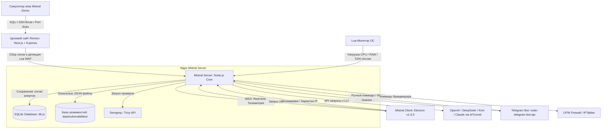

# Научно-исследовательский и технический проект: MISTRAL Defense & Remon
## Комплексная система активной ИБ-аналитики, мониторинга и автоматизированного противодействия угрозам на базе генеративного искусственного интеллекта (SOAR / XDR / SIEM / WAF)

---

## Введение

В современной индустрии информационной безопасности (ИБ) классические средства защиты первого поколения (такие как межсетевые экраны и простые IDS/IPS) больше не способны эффективно противостоять комплексным многовекторным атакам (APT, DDoS, Brute Force, SQLi, XSS). На смену им приходят концепции **активного обнаружения и автоматического реагирования (XDR / SOAR)**. 

Настоящий проект представляет собой программный комплекс оборонного класса **MISTRAL**, объединяющий в единую экосистему:
1. **Remon** — тестовый стенд (веб-приложение) строительно-девелоперской компании с преднамеренно заложенными уязвимостями (SQLi, Auth bypass, Stored XSS) и встроенным Lua WAF (OpenResty) для генерации реалистичного трафика атак.
2. **Mistral Server** — управляющий сервер безопасности (ядро), осуществляющий сбор системной и сетевой телеметрии, хранение инцидентов и логов в СУБД SQLite, расчет уровня угрозы хоста (DEFCON), блокировку нарушителей (UFW / IPTables) и интеграцию с Telegram-ботом.
3. **Mistral Client (v1.5.0)** — кроссплатформенный десктопный терминал оператора SOC (Security Operations Center), реализованный на Electron, содержащий ИИ-ассистента, модули управления SOAR, базу сигнатур уязвимостей, карту киберугроз и MITRE ATT&CK матрицу.
4. **Mistral Demo (Attack Simulator)** — скрипт-эмулятор кибератак на Python для проведения тестирования, демонстрации возможностей и верификации защитных сценариев.

---

## 1. Архитектурная концепция и информационные потоки

Проект спроектирован по модульной распределенной архитектуре. Связующими протоколами выступают **WebSocket Secure (WSS)** для трансляции событий реального времени и **REST API** для управляющих транзакций.

### Схема взаимодействия компонентов системы



### Модель безопасности процессов в Electron
Клиентское приложение Pentagi UI построено по стандартам безопасности Electron:
* **Разделение контекста (`contextIsolation: true`)**: Renderer-процесс (UI) полностью изолирован от Node.js API и системных вызовов.
* **Безопасный мост (`preload.js`)**: Экспортирует ограниченный набор функций `window.electronAPI`, общающихся с главным процессом (`main.js`) посредством механизма IPC (Inter-Process Communication).
* **Сетевая изоляция**: Все запросы к API и WebSocket-соединения обслуживаются главным процессом Electron. Токены авторизации и непереиспользуемые одноразовые токены (nonce) защищают от атак типа Replay (повторное воспроизведение запроса).
* **Content Protection**: В главном окне активирован флаг `setContentProtection(true)`, что предотвращает снятие скриншотов и запись экрана вредоносным ПО на хосте оператора.

---

## 2. Технологический стек проекта

| Компонент | Технология / Библиотека | Назначение |
| :--- | :--- | :--- |
| **GUI Клиента** | Electron.js (v30+) | Кроссплатформенная среда выполнения десктопного приложения. |
| | Vanilla HTML5 / ES6 JS / CSS3 | Интерфейс в стиле Glassmorphism & High-Contrast (Pentagi Red-Black-White). |
| | Chart.js (v4.4.0) | Построение динамических графиков (Gauge риска, сетевая активность). |
| | HTML5 Canvas | Рендеринг интерактивной карты киберугроз и 3D-глобуса MITRE. |
| | Web Audio API | Синтез тревожных звуковых сигналов при критических инцидентах. |
| **Ядро Сервера** | Node.js (V8 Engine) | Асинхронная среда выполнения серверного бэкенда. |
| | Express.js | REST API для авторизации, настроек SOAR, базы уязвимостей и отчетов. |
| | `ws` (WebSockets) | Двунаправленный обмен данными с клиентом SOC в реальном времени. |
| | Winston | Логирование событий системы безопасности с ежедневной ротацией. |
| **База Данных** | `better-sqlite3` | Быстрая встраиваемая СУБД SQLite для логов, инцидентов и пользователей. |
| | JSON Files | Хранение настроек SOAR (`soar_settings.json`) и базы уязвимостей. |
| **ИИ / LLM** | OpenAI SDK | Интеграция с нейросетевыми моделями (DeepSeek, Kimi, Claude) через API. |
| | aitunnel.ru | Защищенный прокси-туннель к моделям ИИ. |
| **Агенты и WAF**| Lua / OpenResty | Модуль фильтрации HTTP-запросов на стороне Nginx (WAF). |
| | Системные Lua-скрипты | Сбор метрик ОС, парсинг `/var/log/auth.log`, мониторинг Docker и SSH. |
| **Инструменты ИБ**| Semgrep SAST | Статический анализ исходного кода приложений на уязвимости. |
| | Trivy | Анализатор безопасности контейнеров Docker и пакетов ОС. |
| | UFW (Uncomplicated Firewall) | Системный брандмауэр Linux для блокировки хостов нарушителей. |

---

## 3. Подробная структура кодовой базы (Repository Code Map)

### 3.1. Клиентская часть (Mistral Client)
* **[main.js](file:///c:/Users/omskp/OneDrive/Рабочий%20стол/Диплом/Mistral%20Сlient/src/main.js)**: Главный процесс Electron. Управляет жизненным циклом окон (Splash Screen и Main Window), инициализирует системный трей, обрабатывает все IPC-вызовы от рендерера, поддерживает постоянное WebSocket-соединение с сервером с адаптивным экспоненциальным переподключением, обрабатывает входящие инциденты и инициирует системные уведомления ОС.
* **[preload.js](file:///c:/Users/omskp/OneDrive/Рабочий%20стол/Диплом/Mistral%20Сlient/src/preload.js)**: Скрипт предварительной загрузки. Безопасно проксирует методы `connectServer`, `sendApiRequest`, `sendWsMessage` и слушатели событий (`onWsMessage`, `onConnStatus`) в глобальную область видимости окна.
* **[index.html](file:///c:/Users/omskp/OneDrive/Рабочий%20стол/Диплом/Mistral%20Сlient/src/templates/index.html)**: Разметка интерфейса (около 1000 строк). HUD-сетка, вкладки (Dashboard, Incidents, Logs, Vuln Database, Threats, Scanners, AI Command, Settings).
* **[main.css](file:///c:/Users/omskp/OneDrive/Рабочий%20стол/Диплом/Mistral%20Сlient/src/static/css/main.css)**: Единая таблица стилей. Анимации свечения, стилизация таблиц, кастомный скроллбар, адаптивная верстка, стек шрифтов JetBrains Mono / Inter.
* **[core.js](file:///c:/Users/omskp/OneDrive/Рабочий%20стол/Диплом/Mistral%20Сlient/src/static/js/core.js)**: Ядро клиентской логики. Обрабатывает WebSocket-события от сервера, координирует состояние приложения, инициализирует сессию, отслеживает бездействие пользователя и запускает автоматические действия.
* **[ui.js](file:///c:/Users/omskp/OneDrive/Рабочий%20стол/Диплом/Mistral%20Сlient/src/static/js/ui.js)**: Модуль отображения данных (97 КБ). Отвечает за рендеринг таблиц логов, инцидентов, карантина, отрисовку графиков Chart.js, генерацию интерактивных тостов, воспроизведение звуков тревоги и управление модальными окнами.
* **[ai.js](file:///c:/Users/omskp/OneDrive/Рабочий%20стол/Диплом/Mistral%20Сlient/src/static/js/ai.js)**: Логика взаимодействия с ИИ. Обработка ИИ-чата, парсинг Markdown в HTML-элементы, рендеринг кнопок «Выполнить скрипт» в ответах ИИ, выбор моделей и автоматическая подгрузка контекста инцидентов.
* **[auth.js](file:///c:/Users/omskp/OneDrive/Рабочий%20стол/Диплом/Mistral%20Сlient/src/static/js/auth.js)**: Модуль авторизации. Обработка ввода учетных данных, валидация полей, NLP-поиск по логам через форму поиска.
* **[cyber-map.js](file:///c:/Users/omskp/OneDrive/Рабочий%20стол/Диплом/Mistral%20Сlient/src/static/js/cyber-map.js)**: Графический движок. Отрисовывает карту мира на `<canvas>`, анимирует векторы атак от географических координат злоумышленников к защищаемому узлу, а также рендерит 3D-глобус (`MiniGlobeRenderer`) в секции MITRE.

### 3.2. Серверная часть (Mistral Server)
* **[server.js](file:///c:/Users/omskp/OneDrive/Рабочий%20стол/Диплом/Mistral%20Server/src/server.js)**: Основное ядро бэкенда (1200+ строк). Запускает HTTP и WebSocket серверы, авторизует клиентов по токену и nonce, обрабатывает REST API маршруты, реализует автокатегоризацию инцидентов по ключевым словам, координирует настройки SOAR, выполняет интеграцию с OpenAI API и сохраняет сгенерированные Markdown-отчеты в `/data/reports/`.
* **[db.js](file:///c:/Users/omskp/OneDrive/Рабочий%20стол/Диплом/Mistral%20Server/src/db.js)**: Контроллер базы данных SQLite. Создает таблицы при первом запуске, выполняет необходимые миграции схемы, осуществляет CRUD-операции для пользователей, логов (server, bot, cve), инцидентов и таблицы карантина хостов.
* **[telegram-bot.js](file:///c:/Users/omskp/OneDrive/Рабочий%20стол/Диплом/Mistral%20Server/src/telegram-bot.js)**: Бот оперативного информирования. Работает по Long Polling, запрашивает авторизацию у администратора SOC при старте диалога, рассылает алерты о критических инцидентах, обрабатывает команду `🧠 АНАЛИЗ ИИ` с помощью callback-кнопок и позволяет просматривать базовую статистику сервера.
* **[scanners.js](file:///c:/Users/omskp/OneDrive/Рабочий%20стол/Диплом/Mistral%20Server/src/scanners.js)**: Обертка над системными утилитами Semgrep и Trivy. Запускает процессы сканирования через дочерние потоки ОС, сохраняет результаты в JSON и возвращает структурированный список находок.
* **[log_forwarder.js](file:///c:/Users/omskp/OneDrive/Рабочий%20стол/Диплом/Mistral%20Server/src/log_forwarder.js)**: Вспомогательный модуль для пересылки внешних логов из ОС и сторонних сервисов в ядро MISTRAL.

---

## 4. Глубокий технический разбор модулей и функций

### 4.1. Авторизация и сессионный контроль
При подключении клиента в окне авторизации отправляется POST-запрос на `/api/auth/login`. При успешной проверке учетных данных в базе SQLite сервер генерирует временный токен `WSS_SECRET_TOKEN` (уникальный для каждой сессии запуска сервера). 

После этого клиент открывает WebSocket-соединение по адресу `ws://host:port/ws`. Сразу после установления TCP-соединения клиент обязан в течение 10 секунд отправить авторизационный пакет:
```json
{
  "event": "auth",
  "data": {
    "token": "mistral-secret-xxxxx",
    "nonce": "k8z2p9"
  }
}
```
Сервер проверяет токен и защищает сессию от атак повтора (Replay): `nonce` заносится в Set `usedNonces`, повторное использование того же `nonce` разрывает соединение. Если авторизация не пройдена за 10 секунд, срабатывает таймаут, и соединение жестко закрывается с кодом `4001`.

**Таймаут бездействия:** В целях безопасности в `core.js` интегрирован мониторинг активности (события мыши, клавиатуры). Если оператор не проявляет активности в течение **5 минут**, сессия сбрасывается, токен уничтожается, и интерфейс блокируется экраном логина.

---

### 4.2. Автоматизированная система реагирования (SOAR)
Ядро SOAR управляется настройками, сохраненными в файле `data/soar_settings.json`.

```
┌────────────────────────────────────────────────────────┐
│               Событие ИБ / Атака                       │
└──────────────────────────┬─────────────────────────────┘
                           ▼
            ┌──────────────────────────────┐
            │   Категоризация инцидента    │
            └──────────────┬───────────────┘
                           ▼
            ┌──────────────────────────────┐
            │   Включен ли SOAR Auto-Ban?  ├─► НЕТ ──► Запись в БД & Алерт в SOC
            └──────────────┬───────────────┘
                           │ ДА (DDoS / SSH Brute Force)
                           ▼
            ┌──────────────────────────────┐
            │   Проверка IP на белый список│─► Исключить 127.0.0.1 / localhost
            └──────────────┬───────────────┘
                           ▼
            ┌──────────────────────────────┐
            │ Выполнение команды блокировки│─► ufw deny from IP to any
            └──────────────┬───────────────┘
                           ▼
            ┌──────────────────────────────┐
            │ Занесение IP в БД Карантина  ├─► Трансляция события по WSS
            └──────────────────────────────┘
```

#### ИИ-Автозащита (Autonomous AI Agent Defense)
При включении опции «ИИ-Автозащита» система переходит в режим активного интеллектуального анализа:
1. **DEFCON 1**: Если зафиксировано **3 критических инцидента подряд** (уровня HIGH или CRITICAL) или произошла утечка конфиденциальных данных (`DATA_LEAK`), система переходит в состояние повышенной боевой готовности. Экран клиента начинает мигать багровым цветом, активируется DEFCON 1.
2. Любое появление инцидента низкого уровня (LOW/MEDIUM) сбрасывает счетчик последовательных угроз в ноль, предотвращая ложные срабатывания.
3. **Автономный режим**: ИИ-Агент получает в промпте весь контекст инцидентов и последние 100 строк логов. Если в настройках разрешено внесение изменений, ИИ генерирует решение. Обнаружив в ответе тег `[AUTOBAN: IP]`, сервер мгновенно блокирует данный адрес на уровне брандмауэра и сохраняет подробный отчет в `/data/reports/report-incidentId.md`.
4. **Информационный режим**: Если ИИ запрещено вносить изменения, он формирует для оператора интерактивную инструкцию с кнопкой `ВЫПОЛНИТЬ`. Оператор SOC изучает рекомендации и выполняет блокирующие скрипты вручную в один клик.

---

### 4.3. База сигнатур и уязвимостей
Управление уязвимостями полностью динамическое. Сигнатуры хранятся на диске сервера в виде отдельных JSON-файлов в папке `data/vulnerabilities/`. 

Пример структуры файла `sql_injection.json`:
```json
{
  "id": "sql_injection",
  "name": "SQL Injection (SQLi)",
  "severity": "HIGH",
  "description": "Exploitation of SQL queries to gain unauthorized database access.",
  "detection_rules": "Check logs for rules/keywords: UNION SELECT, SQLI_AUTH, sql syntax error, OR 1=1.",
  "remediation": "Block attacker IP via UFW firewall. Sanitize incoming inputs, use parameterized queries, block suspicious parameters at WAF level."
}
```
При отправке ИИ-запроса (`ai_task`) сервер динамически сканирует директорию сигнатур, считывает все правила и внедряет их в системный промпт модели ИИ. Это гарантирует, что ИИ-Агент всегда оперирует актуальными критериями обнаружения и схемами устранения угроз, настроенными администратором.

---

### 4.4. Интерактивная система уведомлений в клиенте
В версии 1.5.0 была кардинально улучшена эргономика работы с уведомлениями:
1. **Внутрисистемные интерактивные тосты (Interactive Toast Alerts)**:
   При обнаружении атаки в углу экрана всплывает тост со временем жизни **12 секунд** (для угроз с IP). Он содержит:
   - Бейдж с IP-адресом атакующего. Клик по бейджу фильтрует лог-панель по данному IP.
   - Кнопку **«Логи»**: Мгновенно переключает оператора на вкладку «Логи» и устанавливает фильтр по IP-адресу для детального расследования.
   - Кнопку **«Блок»** (окрашена красным): Позволяет в один клик отправить IP в карантин UFW без перехода во вкладки настроек.
   - Автоматическую паузу таймера исчезновения при наведении курсора мыши.
2. **Системные уведомления Electron Tray Notifications**:
   Дублируют алерты на уровне операционной системы, когда приложение свернуто. Клик по системному уведомлению разворачивает окно приложения, переносит фокус и автоматически открывает карточку соответствующего инцидента.

---

### 4.5. Матрица MITRE ATT&CK и Threat Map
* **MITRE ATT&CK Matrix**: Интерактивная таблица тактик и техник ИБ. При получении инцидента клиент парсит его тип и подсвечивает соответствующие ячейки матрицы (например, *Initial Access*, *Execution*, *Impact*), позволяя оператору визуально оценить стадию Kill Chain атаки.
* **Mini Globe Renderer**: HTML5 Canvas компонент, визуализирующий вращающуюся 3D-модель земного шара с нанесенными точками инцидентов.
* **Threat Map**: Двумерная проекция карты мира. При фиксации инцидента с сервера считываются геоданные GeoIP (координаты широты и долготы). На карте рисуется дуга атаки от точки источника к серверному узлу с пульсирующей анимацией и цветовой кодировкой в зависимости от критичности (Red — Critical, Orange — High).

---

## 5. Сценарии боевого применения и логика реагирования (Playbooks & Operational Scenarios)

В зависимости от вектора атаки, интенсивности угрозы и конфигурации настроек SOAR, комплекс MISTRAL автоматически или в интерактивном режиме задействует защитные меры. Ниже приведена подробная операционная карта для каждого типа инцидента.

### 5.1. Сценарий 1: Сетевая атака типа DDoS / HTTP Flood / SYN Flood
* **Когда применяется**: При попытках нарушителя нарушить доступность веб-сервисов Remon или перегрузить сетевой стек хоста.
* **Что фиксирует атаку**:
  - Агент мониторинга `monitor_system.lua` отслеживает резкий всплеск сетевых соединений (метрика `active_connections` превышает критический порог, например, > 1000).
  - WAF-модуль на стороне Nginx фиксирует аномально высокую частоту запросов от одного IP-адреса (rate-limiting).
* **Что происходит в системе**:
  1. Агент или WAF отправляют POST-запрос на `/api/metrics` или `/api/attack-detected` сервера MISTRAL.
  2. Сервер создает инцидент типа `DDOS_FLOOD` или `HTTP_FLOOD` уровня `HIGH`.
  3. Клиентское приложение получает событие по сокету и:
     - Отрисовывает резкий подъем графика сетевой активности.
     - Добавляет запись в таблицу атак DDoS.
     - Воспроизводит звуковой сигнал тревоги.
     - Показывает всплывающий тост-алерт с IP-адресом атакующего.
  4. Telegram-бот шлет уведомление администраторам.
* **Что включается на уровне защиты**:
  - **Если включен SOAR Auto-Ban DDoS**: Сервер немедленно (в течение 50-100 мс) выполняет команду блокировки в ОС `ufw deny from <IP> to any`, отправляет IP в БД карантина и транслирует обновление клиентам.
  - **Если SOAR выключен (Ручной SOC-режим)**: Оператор видит тост в GUI клиента и может:
    * Кликнуть «Блок» прямо в тосте — IP отправится в карантин.
    * Кликнуть «Логи» в тосте — его перенаправит в журнал событий с автофильтрацией по данному IP для расследования перед баном.
  - **ИИ-Автозащита (Autonomous AI)**: При активации DEFCON 1 ИИ анализирует логи, выдает тег `[AUTOBAN: IP]` для блокировки и генерирует Markdown-отчет с рекомендациями по настройке `iptables` и конфигурированию директив `limit_req` в `nginx.conf`.

---

### 5.2. Сценарий 2: Перебор паролей (SSH Brute Force)
* **Когда применяется**: При попытках автоматизированного подбора паролей к SSH-порту (22) сервера MISTRAL или хостов.
* **Что фиксирует атаку**:
  - Lua-скрипт `monitor_auth.lua` непрерывно сканирует системный журнал ОС `/var/log/auth.log` (или `journalctl`). При обнаружении паттернов `Failed password for ... from <IP> port ... ssh2` (более 5 попыток за 30 секунд) фиксирует Brute Force.
* **Что происходит в системе**:
  1. Скрипт отправляет данные об инциденте на `/api/incidents`.
  2. Сервер создает инцидент `SSH_BRUTE_FORCE` уровня `HIGH`.
  3. Клиент SOC получает алерт, подсвечивает ячейку матрицы MITRE ATT&CK (техника *Credential Access / Brute Force*), проигрывает аудио-предупреждение и отображает инцидент в панели.
* **Что включается на уровне защиты**:
  - **Если включен SOAR Auto-Ban Brute Force**: Сервер выполняет команду `ufw deny from <IP> to any`, заносит адрес в карантин. Дополнительный доступ нарушителю к SSH перекрывается на уровне ядра Linux.
  - **ИИ-Анализ**: ИИ-Агент рекомендует администратору отключить парольную аутентификацию в `/etc/ssh/sshd_config` (`PasswordAuthentication no`) и перевести авторизацию исключительно на SSH-ключи, а также установить утилиту `fail2ban`.

---

### 5.3. Сценарий 3: Внедрение SQL-кода (SQL Injection) и XSS на веб-стенде
* **Когда применяется**: При попытках злоумышленника выполнить произвольные SQL-команды в БД защищаемого веб-приложения Remon или внедрить вредоносные JS-скрипты.
* **Что фиксирует атаку**:
  - Встроенный в Nginx модуль Lua WAF инспектирует тело входящих HTTP-запросов (GET/POST параметры).
  - При обнаружении ключевых слов (сигнатур) SQL-инъекций (например, `UNION SELECT`, `' OR '1'='1`) или XSS-тегов (`<script>`, `onerror=`, `onload=`) запрос блокируется, и генерируется POST-уведомление на `/api/attack-detected` сервера MISTRAL.
* **Что происходит в системе**:
  1. Сервер классифицирует инцидент как `SQL_INJECTION` или `STORED_XSS` уровня `HIGH`/`CRITICAL` (благодаря автокатегоризатору `autoCategorizeSeverity`).
  2. Telegram-бот присылает алерт с inline-кнопкой `🧠 АНАЛИЗ ИИ`.
  3. Оператор видит инцидент в клиенте, открывает его drawer, где отображаются GeoIP атакующего, а также точный дамп payload-атаки (какие параметры и куда пытался внедрить хакер).
* **Что включается на уровне защиты**:
  - **Анализ по кнопке ИИ**: Оператор нажимает `🧠 Анализ ИИ`. Модель (например, DeepSeek V4) изучает уязвимый параметр и SQL-запрос, после чего выдает готовый исправленный патч кода для бэкенда Express.js (например, перевод запроса на подготовленные плейсхолдеры: `db.prepare('SELECT * FROM objects WHERE id = ?')` вместо конкатенации строк).
  - В ответе ИИ выводится блок кода со специальной кнопкой `ВЫПОЛНИТЬ`. Клик по кнопке отсылает скрипт исправления на сервер, который автоматически обновляет код приложения в песочнице и перезапускает его.

---

### 5.4. Сценарий 4: Срабатывание Приманки (Honeypot Decoy)
* **Когда применяется**: При разведке портов или сканировании сети злоумышленником.
* **Что фиксирует атаку**:
  - Сервер MISTRAL запускает легковесный honeypot-слушатель (например, фейковый платежный шлюз `remon_payment_gateway` на порту 8081).
  - Легитимные пользователи никогда не обращаются к этому скрытому ресурсу. Любое входящее соединение на порт 8081 расценивается как целенаправленное сканирование.
* **Что происходит в системе**:
  1. При подключении к honeypot-порту сервер мгновенно фиксирует событие.
  2. Генерируется инцидент `HONEYPOT_TRIGGERED` с наивысшим уровнем критичности — `CRITICAL`.
  3. Включается DEFCON 1, клиент SOC мигает красным, Telegram-бот шлет мгновенное push-уведомление с высоким приоритетом.
* **Что включается на уровне реагирования**:
  - Так как это заведомо вредоносное действие, система безопасности не ожидает накопления инцидентов.
  - IP-адрес сканера немедленно отправляется в жесткий карантин (`ufw deny`).
  - ИИ-Агент переводится в режим автономного расследования: генерируется отчет об активности хоста, вычисляется его геолокация и ISP через API, данные заносятся в архив отчетов (`/data/reports/`).

---

### 5.5. Сценарий 5: Утечка данных (Data Leak)
* **Когда применяется**: При несанкционированном размещении или копировании конфиденциальной информации (ключей API, паролей, персональных данных) в публичных папках веб-сервера.
* **Что фиксирует атаку**:
  - Фоновый агент ОС сканирует файловую систему и логи на регулярные выражения секретов (regex на приватные ключи SSH, токены AWS, базы данных в незашифрованном виде).
* **Что происходит в системе**:
  1. Фиксируется событие утечки, отправляется инцидент `DATA_LEAK` уровня `CRITICAL`.
  2. Включается ИИ-автозащита (поскольку в настройках взведен триггер `aiTriggerOnLeaks`).
  3. ИИ-Агент активизируется автономно.
* **Что включается на уровне реагирования**:
  - ИИ проверяет путь к скомпрометированному файлу.
  - **В автономном режиме**: ИИ-Агент пишет и выполняет bash-скрипт изоляции: удаляет файл из публичной директории, ограничивает права доступа к директории (`chmod 600`) и сбрасывает скомпрометированные ключи в конфигурационных файлах.
  - Администратор получает подробный отчет в формате Markdown о том, какой секрет утек, где он находился и какие действия ИИ предпринял для митигации.

---

### 5.6. Сценарий 6: Уязвимости контейнеров и кода (DevSecOps Audit)
* **Когда применяется**: При плановом аудите безопасности или интеграции в CI/CD процесс для предотвращения деплоя уязвимого ПО.
* **Что фиксирует риски**:
  - Утилиты **Semgrep SAST** (статический анализ кода) и **Trivy** (сканирование зависимостей и образов).
* **Что происходит в системе**:
  1. Оператор SOC во вкладке `Scanners` выбирает тип сканера (Semgrep или Trivy) и указывает путь к проекту.
  2. Клиент шлет WSS-запрос `run_scan`.
  3. Сервер запускает утилиту через дочерний процесс и транслирует вывод в реальном времени в консоль клиента.
  4. Обнаруженные критические уязвимости (CVE с рейтингом High/Critical или небезопасные вызовы функций `eval`, `exec`) записываются в журнал логов типа `cve`.
* **Что включается на уровне защиты**:
  - Сервер кэширует результаты сканирования.
  - ИИ-Агент анализирует список обнаруженных CVE и предлагает конкретные версии npm-пакетов для обновления (`npm audit fix` или точечный апгрейд зависимостей).
  - В случае Semgrep ИИ указывает конкретную строку кода с небезопасным вызовом и рефакторит код для исключения уязвимостей типа Command Injection или Path Traversal.

---

## 6. REST API Эндпоинты ядра MISTRAL

| Метод | Маршрут | Доступ | Описание |
| :--- | :--- | :--- | :--- |
| **POST** | `/api/auth/login` | Публичный | Авторизация пользователя, выдача сессионного WSS-токена. |
| **GET** | `/api/health` | Публичный | Статус сервера, uptime, активная модель ИИ. |
| **GET** | `/api/soar-settings` | Оператор | Получение текущих настроек SOAR. |
| **POST** | `/api/soar-settings` | Администратор | Сохранение настроек SOAR (авто-бан, DEFCON пороги). |
| **GET** | `/api/users` | Администратор | Список всех зарегистрированных пользователей SOC. |
| **POST** | `/api/users` | Администратор | Добавление нового пользователя/оператора. |
| **GET** | `/api/logs` | Оператор | Выборка логов с фильтрацией по типу, уровню и датам. |
| **POST** | `/api/logs` | Мониторы | Запись нового серверного системного лога. |
| **GET** | `/api/incidents` | Оператор | Список инцидентов с фильтрацией по важности. |
| **PATCH**| `/api/incidents/:id` | Оператор | Обновление статуса инцидента (`resolved`, `in_review`) и комментариев. |
| **DELETE**| `/api/incidents` | Администратор | Очистка истории инцидентов. |
| **GET** | `/api/quarantine` | Оператор | Список заблокированных IP и причин бана. |
| **POST** | `/api/quarantine` | Оператор | Ручное добавление IP-адреса в бан-лист UFW. |
| **DELETE**| `/api/quarantine/:ip` | Оператор | Разблокировка IP-адреса в UFW и удаление из карантина. |
| **POST** | `/api/metrics` | Мониторы | Прием телеметрии ОС и контейнеров от Lua-скриптов. |
| **POST** | `/api/attack-detected`| Remon WAF | Регистрация инцидента атаки от WAF веб-приложения. |
| **GET** | `/api/vulnerabilities`| Оператор | Выгрузка базы сигнатур уязвимостей. |
| **POST** | `/api/vulnerabilities`| Администратор | Добавление или обновление сигнатуры уязвимости на диске. |
| **DELETE**| `/api/vulnerabilities/:id`|Администратор| Удаление сигнатуры уязвимости. |
| **GET** | `/api/ai-reports` | Оператор | Список сгенерированных Markdown-отчетов ИИ-Агента. |
| **GET** | `/api/ai-reports/:id` | Оператор | Чтение содержимого отчета ИИ для рендеринга. |
| **POST** | `/api/reset-demo` | Администратор | Сброс демонстрационного стенда до начального состояния. |
| **POST** | `/api/execute-ai-script`|Администратор | Выполнение сгенерированного ИИ bash-кода митигации. |

---

## 7. Протокол WebSocket событий (WSS Data Frame Schema)

Обмен данными по сокету происходит асинхронно. Все сообщения передаются в формате JSON с обязательным полем `event`.

### От клиента к серверу:
* **`get_stats`**: Запрос сводных статистических показателей безопасности.
* **`get_incidents`**: Запрос списка последних 100 инцидентов.
* **`get_logs`**: Запрос последних логов с указанием типа:
  ```json
  { "event": "get_logs", "data": { "type": "server", "limit": 200 } }
  ```
* **`switch_model`**: Переключение используемой ИИ-модели (`deepseek-v4-pro`, `kimi-k2.6`, `claude-sonnet-4.6`).
* **`run_scan`**: Запуск встроенного сканера:
  ```json
  { "event": "run_scan", "data": { "scanType": "semgrep", "target": "." } }
  ```
* **`ai_task`**: Запрос ИИ-анализа:
  ```json
  {
    "event": "ai_task",
    "data": {
      "task": "Проанализируй атаку SQL-инъекции...",
      "model": "deepseek-v4-pro",
      "incidentId": "uuid-xxxx-xxxx"
    }
  }
  ```

### От сервера к клиенту (Broadcast / Unicast):
* **`auth_success`**: Подтверждение авторизации клиента, передача IP клиента.
* **`stats`**: Передача обновленных счетчиков инцидентов и объемов логов.
* **`incidents_list` / `logs_list`**: Ответные списки исторических данных.
* **`log`**: Трансляция нового лога реального времени.
* **`incident`**: Трансляция нового зарегистрированного инцидента (запускает звуковую тревогу и тост в GUI).
* **`incident_updated`**: Синхронизация при изменении статуса или добавлении комментария к инциденту.
* **`quarantine_updated`**: Обновление списка заблокированных IP.
* **`soar_settings_updated`**: Оповещение об изменении конфигурации авто-защиты.
* **`ai_result`**: Возврат ответа модели ИИ на отправленную задачу.
* **`scan_result`**: Результаты работы Semgrep или Trivy для вывода в терминал клиента.

---

## 8. История разработки и исправленные архитектурные ошибки

В процессе реализации и интеграции модулей системы был устранен ряд критических дефектов и оптимизирован поток данных:

1. **Устранение падения парсера БД (`vulns.forEach is not a function`)**:
   * *Симптом:* При сбоях запроса к API или пустом ответе сервер возвращал некорректную структуру данных. В GUI вызов метода `.forEach` на переменной, не являющейся массивом, приводил к остановке выполнения JS-скрипта UI и заморозке вкладки базы уязвимостей.
   * *Решение:* В `ui.js` внедрены защитные блоки с методом `Array.isArray(vulns)`. В случае отсутствия или некорректного формата данных переменная инициализируется пустым массивом `[]`, исключая падение рендерера.

2. **Защита от некорректных ответов веб-сервера (404 HTML Response)**:
   * *Симптом:* При неверном пути запроса или рестарте бэкенда API-клиент в Electron (`sendApiRequest` в `main.js`) пытался принудительно распарсить тело ответа методом `.json()`. Поскольку сервер возвращал стандартную HTML-страницу ошибки 404, парсер падал с синтаксической ошибкой `Unexpected token '<'...`.
   * *Решение:* Метод переписан с анализом заголовков ответа. Сначала запрашивается `content-type`. Если он содержит подстроку `application/json`, вызывается метод `.json()`, иначе ответ считывается как обычный текст `.text()` и оборачивается в структурированный JSON-объект ошибки: `{ error: "Server returned non-JSON response (status): ..." }`.

3. **Локализация контекста WebSocket в Renderer-процессе**:
   * *Симптом:* Код рендерера пытался опрашивать состояние `ws.readyState` при отправке ИИ-запросов и запуске сканеров. Это приводило к сбоям, так как из соображений безопасности сокет открыт исключительно в главном процессе Electron, а переменная `ws` в области видимости рендерера всегда оставалась `null`.
   * *Решение:* Логика полностью переведена на IPC-сообщения. Все функции отправки (`sendAITask`, `runSecurityScan`) теперь транслируют команды в главный процесс через `electronAPI.sendWsMessage`. Состояние сокета отслеживается асинхронно через IPC-событие `conn-status`.

4. **Предотвращение утечек ресурсов при закрытии приложения**:
   * *Симптом:* При выходе из приложения Electron процесс продолжал работать в фоне из-за неразрешенных асинхронных сокет-соединений, а также пытался выводить трей-оповещения ОС, что вызывало краш процесса из-за обращения к уничтоженным системным ресурсам.
   * *Решение:* Внедрена глобальная переменная состояния `isAppQuitting = true` в жизненный цикл Electron. В обработчиках `before-quit` и `window-all-closed` WebSocket-клиент принудительно терминируется (`wsClient.terminate()`), очищаются все таймеры автоподключения, а вызов новых уведомлений ОС блокируется, если приложение находится в стадии завершения.

5. **Оптимизация рендеринга логов реального времени (Throttling и автоскролл)**:
   * *Симптом:* При интенсивных сетевых атаках (DDoS, брутфорс) поток логов перегружал DOM-дерево. Предыдущая реализация сброса логов через `requestAnimationFrame` отбрасывала промежуточные пакеты данных, что приводило к потере логов в интерфейсе оператора.
   * *Решение:* Рендеринг логов переведен на схему с накоплением данных в буфере и отрисовкой по таймеру `setTimeout` с ограничением частоты обновлений. Реализован надежный механизм автоскролла: если контейнер логов прокручен оператором наверх для анализа, автоскролл отключается; если прокручен до низа — плавно докручивает новые строки.

6. **Создание интерактивных тостов для предотвращения спама уведомлениями**:
   * *Симптом:* Постоянно всплывающие системные уведомления Windows во время DDoS-атак мешали работе оператора и приводили к зависанию интерфейса уведомлений ОС.
   * *Решение:* Были созданы внутренние интерактивные тосты. Системные уведомления Windows теперь срабатывают только при переходе приложения в фоновый режим. Внутри приложения тосты содержат прямые ссылки на переходы по логам с автофильтрацией по IP и кнопку мгновенного бана, повышая скорость реагирования оператора SOC в разы.

---

## 9. Инструкция по развертыванию и демонстрации проекта

### 9.1. Системные требования
* **ОС**: Ubuntu 22.04 LTS (для сервера, WAF и сканеров) / Windows 10/11 (для запуска клиента).
* **Среда выполнения**: Node.js v18.0.0+, Python 3.10+.
* **Зависимости**: UFW (брандмауэр), Semgrep, Trivy, Docker Engine (для аудита контейнеров).

### 9.2. Настройка окружения сервера (`Mistral Server/.env`)
Создайте файл `.env` в корне сервера:
```ini
AITUNNEL_API_KEY=your_aitunnel_key_here
AITUNNEL_BASE_URL=https://api.aitunnel.ru/v1/
WSS_PORT=8080
API_PORT=8080
TELEGRAM_BOT_TOKEN=your_telegram_bot_token_here
BOT_HTTP_PORT=8081
```

### 9.3. Запуск компонентов

1. **Запуск базы данных и бэкенда (Server)**:
   ```bash
   cd "Mistral Server"
   npm install
   npm start
   ```
   *При первом запуске сервер автоматически создаст SQLite БД `mistral.db` в папке `data`, зарегистрирует администратора (`admin / admin`) и развернет JSON-сигнатуры уязвимостей.*

2. **Запуск Telegram-бота безопасности**:
   ```bash
   cd "Mistral Server/src"
   node telegram-bot.js
   ```

3. **Запуск Клиентского Терминала (Client)**:
   ```bash
   cd "Mistral Client"
   npm install
   npm start
   ```

4. **Симуляция атак для презентации**:
   Запустите симулятор на тестовой машине для генерации инцидентов:
   ```bash
   cd "Mistral Demo"
   python attack_simulator.py
   ```
   *Скрипт начнет имитировать атаки SQL-инъекций и DDoS-флуда, отправляя данные на сервер MISTRAL, что вызовет срабатывание алертов в клиенте и Telegram-боте.*

---

## 10. Описание структуры файлов проекта для презентации (слайдов)

Данный раздел содержит структурированную информацию о назначении каждого файла программного комплекса. Материал подготовлен для прямого переноса на слайды презентации дипломного проекта.

### Слайд 1: Архитектура десктопного терминала (Mistral Client)
* **main.js** (Главный процесс Electron) — управление жизненным циклом окон, системным треем, IPC-вызовами и фоновым WebSocket-соединением с сервером с экспоненциальным автоподключением.
* **preload.js** (Скрипт предзагрузки) — безопасный изоляционный мост (Context Bridge) для проброса API обмена сообщениями между Renderer и Main-процессами без раскрытия Node.js в веб-слое.
* **index.html** (Интерфейс оператора SOC) — одностраничный HUD-интерфейс, содержащий модули мониторинга (Dashboard), списки инцидентов, журналы логов, карту киберугроз, сканеры SAST/Trivy и чат ИИ.
* **main.css** (Визуальный SOC-стиль) — таблица стилей, реализующая темную неоновую тему (Glassmorphic) с анимацией сетевой активности, высокой контрастностью и адаптивной блочной сеткой.

### Слайд 2: Интерактивная логика и визуализация (Mistral Client / JS)
* **core.js** (Ядро бизнес-логики) — управление WebSocket-событиями, поддержание сессии оператора, обработка входящих алертов и контроль таймаута бездействия (автоблокировка через 5 минут).
* **ui.js** (Интерактивный UI) — динамический рендеринг таблиц логов, инцидентов и карантина, отрисовка графиков Chart.js, воспроизведение тревожных звуков и менеджмент всплывающих тост-уведомлений.
* **ai.js** (Интеграция с ИИ) — логика чата с ассистентом, парсинг Markdown-отчетов в HTML, автоматическая сборка контекста инцидентов и обработка безопасного запуска скриптов.
* **cyber-map.js** (Визуализация кибератак) — графический движок на `<canvas>` для отрисовки гео-карты мира, анимированных векторов сетевых атак в реальном времени и вращающегося 3D-глобуса MITRE.
* **auth.js** (Управление сессиями) — обработка форм авторизации, валидация полей ввода и реализация поисковой строки NLP для фильтрации логов.

### Слайд 3: Управляющий сервер и база данных (Mistral Server)
* **server.js** (Ядро бэкенда) — обработка REST API, WebSocket-сервер для связи с SOC-терминалом, динамическая категоризация инцидентов, интеграция с моделями LLM и логика автоблокировки SOAR.
* **db.js** (Контроллер СУБД SQLite) — создание таблиц БД, выполнение миграций схемы данных, CRUD-операции для хранения инцидентов, логов безопасности и учетных записей пользователей.
* **telegram-bot.js** (Оповещатель безопасности) — Telegram-бот с двухфакторной авторизацией, рассылающий мгновенные оповещения о критических угрозах с возможностью быстрой ИИ-аналитики и блокировки IP.
* **scanners.js** (Анализ защищенности) — интеграция со статическим анализатором кода Semgrep (SAST) и сканером уязвимостей контейнеров Trivy посредством асинхронного запуска CLI-утилит.
* **activate_security.sh** (Авто-харденинг ОС) — bash-скрипт для автоустановки Lua и fail2ban, настройки строгих правил брандмауэра UFW и блокировки несанкционированного доступа.

### Слайд 4: Распределенные Lua-агенты (Системные мониторы ОС)
* **monitor_network.lua** (Сетевой анализатор) — непрерывный парсинг утилиты `ss`, подсчет полуоткрытых соединений (SYN-RECV) для детекции DDoS-атак и извлечение IP-адресов нарушителей.
* **monitor_system.lua** (Монитор ресурсов) — сбор телеметрии производительности хоста (CPU, RAM, емкость дисков) и мониторинг активности/событий Docker-контейнеров.
* **monitor_auth.lua** (Анализатор аутентификации) — мониторинг файла `/var/log/auth.log` в реальном времени для мгновенного обнаружения попыток подбора паролей по SSH (Brute Force).
* **monitor_integrity.lua** (Контроль целостности файлов) — сканирование критических директорий (`/bin`, `/etc`, `/sbin`) и сверка контрольных хэш-сумм SHA-256 для выявления несанкционированных изменений.
* **run-monitors.sh** (Диспетчер демонов) — скрипт управления фоновым запуском, остановкой и проверкой статуса всех Lua-мониторов с записью логов.

### Слайд 5: Тестирование и веб-стенд (Remon / Demo)
* **Remon** ( Next.js / Express Web Application) — полноценный веб-сайт строительной компании с намеренно внедренными OWASP-уязвимостями (SQL-инъекции, обход авторизации) для демонстрации успешного отражения атак.
* **attack_simulator.py** (Симулятор атак) — многопоточный Python-скрипт для генерации реалистичного трафика кибератак (DDoS, SQLi, SSH Brute Force, сканирование портов) с целью тестирования систем защиты.

