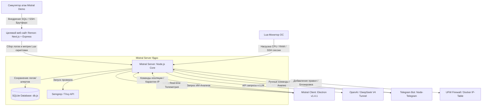

# Научно-исследовательский и технический проект: MISTRAL Defense & Remon
## Комплексная система активной ИБ-аналитики, мониторинга и автоматизированного противодействия угрозам на базе генеративного искусственного интеллекта

---

## Введение

В современной индустрии информационной безопасности (ИБ) классические средства защиты (такие как брандмауэры и системы обнаружения вторжений первого поколения - IDS) постепенно уступают место концепции **активного обнаружения и реагирования (XDR / SOAR)**. Настоящий дипломный проект представляет собой программный комплекс оборонного класса, объединяющий в единую экосистему:
1. **Remon** — тестовый стенд (веб-приложение) с заложенными уязвимостями для отработки векторов атак.
2. **Mistral Server** — управляющий сервер безопасности (ядро), собирающий логи, вычисляющий Defcon-статус угрозы, блокирующий атакующие IP и интегрированный с Telegram-ботом реагирования.
3. **Mistral Client (v1.4.2)** — кроссплатформенный десктопный терминал оператора ИБ с ИИ-ассистентом, встроенными статическими сканерами безопасности и системой авто-защиты.
4. **Mistral Demo** — симулятор кибератак для верификации защитных механизмов.

---

## 1. Архитектурная концепция и архитектурная схема

Проект спроектирован по микросервисной схеме с использованием протоколов реального времени **WebSocket Secure (WSS)** и стандартных **REST API** интерфейсов. Вся телеметрия собирается асинхронно, предотвращая задержки в работе защищаемого ПО.

### Схема информационных потоков и взаимодействия компонентов:



---

## 2. Технологический стек проекта

Комплекс базируется на технологиях высокой производительности и масштабируемости:
* **Frontend целевого приложения**: React 18, Next.js 14, TailwindCSS (адаптивный премиум-интерфейс).
* **Backend целевого приложения**: Express.js, SQLite3, CORS-защита, JWT-авторизация.
* **Сервер Безопасности (Mistral Server)**: Node.js (V8 Engine), WebSocket Server (`ws`), SQLite3 (база данных логов, инцидентов и пользователей), HTTP/HTTPS SSL-туннели.
* **Терминал Оператора (Mistral Client v1.4.2)**: Electron.js framework (пакетирование в кроссплатформенный Portable `.exe`), HTML5/ES6, Vanilla CSS (интерфейс высокого контраста в стиле Pentagi: Red-Black-White), Chart.js (визуализация метрик в реальном времени).
* **Интегрированные сканеры**: Semgrep SAST (анализ уязвимостей в исходном коде), Trivy Container Scanner (проверка зависимостей и образов).
* **Интеграция ИИ**: OpenAI API Client, подключенный по безопасному SSL-туннелю к нейросетевым моделям **DeepSeek V4 Pro**, **Kimi K2.6** и **Claude Sonnet 4.6**.

---

## 3. Детальный разбор компонентов

### 3.1. Remon — Уязвимый веб-стенд
Имитирует портал строительно-девелоперской компании. Включает:
* **Публичную часть**: Каталог объектов недвижимости, формы заявок, отзывы.
* **Административную панель**: Авторизация по сессиям, управление базой данных. Внедрён модуль **Global Media** для централизованного динамического управления рекламными баннерами, позволяющий наглядно демонстрировать XSS (Cross-Site Scripting) при внедрении вредоносных скриптов в баннерные поля.
* **Специальные уязвимости**:
  1. *SQL Injection (SQLi)* на странице фильтрации недвижимости.
  2. *Broken Authentication* (слабая политика паролей операторов).
  3. *Cross-Site Scripting (Stored XSS)* в блоках отзывов и Global Media.
  4. *Sensitive Data Exposure* (утечка системных путей в ответах об ошибках).

### 3.2. Mistral Server — Управляющий бэкэнд безопасности
Абстрагирует функции мониторинга, накопления телеметрии и принятия решений:
* **База Данных (db.js)**: Реализована на SQLite. Хранит инциденты, историю карантина и три категории логов: `server` (внутренние события системы защиты), `bot` (команды из Telegram) и `cve` (отчёты сканирования зависимостей).
* **Persistence на старте**: При загрузке сервера функция `loadPersistedData()` автоматически восстанавливает из БД последние 2000 записей логов и 1000 инцидентов в активную оперативную память. Это исключает пустые виджеты у оператора при рестартах.
* **Карантинный менеджер**: Имеет API для мгновенной блокировки IP-адресов атакующих. При блокировке генерирует системный алерт и обновляет правила сетевой маршрутизации.
* **Мониторинг хоста**: Принимает телеметрию (CPU/RAM нагрузки, активные SSH-сессии, подозрительные процессы) от встроенных системных Lua-мониторов.

### 3.3. Mistral Client (v1.4.2) — Рабочее место аналитика ИБ
Десктопное приложение, оптимизированное для экстренного мониторинга и анализа инцидентов.

* **Обновление до версии 1.4.2**: Проведен фикс интерфейса и потока данных: в таблицы DDoS/Flood Attempts интегрирован показ реальных метрик сетевых TCP-перегрузок (от `monitor_network.lua`), исправлено обновление DOM для критических угроз (Threats tab) в реальном времени. Ранее (в 1.4.1) была переработана подсистема нейросетевого ИИ-агента и исправлены баги импортов ESM для работы ASAR-архивов.
* **Стиль Pentagi (Черный-Красный-Белый)**: Интерфейс с высоким уровнем считываемости информации. Использован чистый глубокий чёрный цвет для фонов (`#000000`), чистый белый (`#FFFFFF`) для текста и данных, и акцентный красный (`#FF0000`) для элементов тревоги, индикаторов DEFCON и активных переключателей. Никаких раздражающих цветных обводок карт — только тонкие премиальные разделители `rgba(255,255,255,0.12)`.
* **Функциональные возможности**:
  1. **Dashboard & Running Logs**: Лента системных логов в реальном времени с функцией автоматической плавной прокрутки. Pre-populate механизм загружает логи сразу при авторизации в панели.
  2. **Интерактивный ИИ Анализ**:
     - Возможность переключения ИИ-моделей (DeepSeek V4 Pro, Kimi K2.6, Claude Sonnet 4.6).
     - **Фильтр инцидентов**: Выпадающий список инцидентов с фильтрацией по степени критичности (`ALL`, `CRITICAL`, `HIGH`, `MEDIUM`, `LOW`). При выборе инцидента его полный контекст, описание и дамп логов автоматически формируют защитный промпт для ИИ.
  3. **Автоматическая Оборона (Consecutive Threat auto-defense)**:
     - Если система перехватывает **3 критических инцидента подряд** (CRITICAL или HIGH), автоматически активируется протокол самозащиты **DEFCON 1**.
     - Экран мигает тревожным багровым светом, статус переходит в режим боевой тревоги, контекст атак мгновенно передается ИИ, который генерирует защитный патч или скрипт блокировки без участия человека.
     - Любое появление лога уровня LOW или MEDIUM мгновенно сбрасывает счетчик угроз в ноль, предотвращая ложные срабатывания.
  4. **Встроенные сканеры безопасности (🛡️ Scanners)**:
     - Интегрирована вкладка ручного запуска утилит **Semgrep** и **Trivy**.
     - Оператор может указать целевую папку исходного кода или Docker-образ прямо из интерфейса клиента.
     - Результаты сканирования транслируются в реальном времени во встроенный терминал с синтаксическим разделением ошибок, предупреждений и критических уязвимостей с указанием строк кода и уязвимых библиотек.

---

## 4. Структура кодовой базы и файлов проекта (Repository Code Map)

Для предотвращения искажения данных другими нейросетями и точного понимания архитектуры, ниже приведено полное дерево файлов с описанием ключевых функций и классов:

```
Диплом/
├── README.md                           # Общее описание дипломного проекта
├── project_description_diploma.md      # Данное детальное техническое описание для ГАК и ИИ
│
├── Mistral Server/                     # Управляющее ядро (бэкэнд безопасности)
│   ├── package.json                    # Зависимости (express, ws, winston, sqlite3, dotenv)
│   ├── start.bat                       # Скрипт быстрого запуска под Windows
│   ├── install_audit.sh                # Установочный shell-скрипт для мониторинга
│   ├── src/
│   │   ├── server.js                   # Основной файл Express + WebSocket Server (wss)
│   │   │                               # Функции: addLog(), addIncident(), broadcast(), loadPersistedData()
│   │   │                               # WS-обработчики: auth, get_logs, get_incidents, ai_task, run_scan
│   │   ├── db.js                       # Контроллер SQLite (методы: addLog, getLogs, addIncident, quarantineIp)
│   │   ├── scanners.js                 # API-интерфейс запуска Semgrep SAST и Trivy Vulnerability Scan
│   │   └── telegram-bot.js             # Модуль Telegram-уведомлений и удаленного ИИ-анализа через бот
│   └── monitors/
│       └── lua/                        # Скрипты сбора телеметрии
│           ├── monitor_auth.lua        # Отслеживание событий авторизации (SSH / Auth) в логах ОС
│           └── monitor_system.lua      # Сбор системной телеметрии (CPU, RAM, Disk, Active Connections)
│
├── Mistral Сlient/                     # Десктопная панель оператора ИБ (Electron)
│   ├── package.json                    # Конфиг Electron-builder (сборка v1.4.2)
│   ├── start.bat                       # Скрипт быстрого запуска под Windows
│   ├── LICENSE.txt                     # Текст лицензии для установщика NSIS
│   ├── src/
│   │   ├── main.js                     # Главный процесс Electron (Window Manager, Splash Screen, IPC)
│   │   ├── preload.js                  # Защищенный мост contextBridge между Electron и DOM
│   │   ├── client-server.js            # Локальный express-сервер для отдачи интерфейса приложения
│   │   ├── static/                     # Статические ассеты (логотипы, иконка logo.ico, logo.svg)
│   │   └── templates/
│   │       └── index.html              # Ключевой файл интерфейса. Логика, Vanilla CSS, JS
│   │                                   # Методы: switchTab(), populateAIIncidentDropdown(), selectIncidentForAI(),
│   │                                   # runSecurityScan(), triggerAutoDefense(), addLiveEntry()
│   └── dist/                           # Директория скомпилированных exe-файлов версии 1.4.2
│       ├── MISTRAL-Defense-Portable-1.4.2.exe  # Портативная версия (полностью автономная)
│       └── MISTRAL Defense Setup 1.4.2.exe     # Инсталлятор NSIS для Windows
│
├── Remon/                              # Уязвимый веб-стенд (учебный портал недвижимости)
│   ├── frontend/                       # Клиентская часть на Next.js (TypeScript/TSX)
│   │   ├── src/app/
│   │   │   ├── page.tsx                # Главная страница Remon
│   │   │   └── reset-password/page.tsx # Страница сброса паролей
│   │   └── src/components/
│   │       └── EditableMediaBlock.tsx  # Компонент управления баннерами в панели Global Media
│   └── backend/                        # API сервер приложения Remon (Express)
│
└── Mistral Demo/                       # Симулятор атак для отладки
    ├── attack_simulator.py             # Сценарии: сканирование портов, брутфорс, SQLi
    └── start_demo.bat                  # Лаунчер симулятора для демонстрации
```

---

## 5. Практические ИБ-кейсы и Аналитика (Материал для Диплома)

Для демонстрации эффективности работы системы в дипломном проекте выделено три основных сценария:

### Кейс 1: Автоматическое пресечение брутфорса SSH и изоляция нарушителя
* **Сценарий**: Нарушитель выполняет атаку методом перебора паролей (Brute Force) на SSH-порт сервера.
* **Аналитика**: 
  1. Lua-скрипт мониторинга авторизации `monitor_auth.lua` перехватывает неудачные попытки входа в системных журналах Linux.
  2. Данные передаются на `Mistral Server`, который моментально генерирует инцидент уровня `HIGH`.
  3. На десктопном клиенте Mistral Client в таблице `SSH / Auth Attempts` мгновенно появляется запись об атаке с указанием целевого пользователя, IP и точного времени.
  4. Оператор может в один клик нажать кнопку `🛡 КАРАНТИН` — сервер отправит IP-адрес злоумышленника в изолятор, заблокировав его на уровне брандмауэра и внеся запись в таблицу карантина.

### Кейс 2: Отработка атаки SQL-инъекции на Remon с ИИ-расследованием
* **Сценарий**: Злоумышленник внедряет SQL-код `' OR '1'='1` в строку поиска жилого комплекса на сайте Remon для обхода аутентификации.
* **Аналитика**:
  1. Веб-сервер Remon детектирует аномальный паттерн в SQL-запросе и шлёт алерт на `Mistral Server`.
  2. `Mistral Server` автоматически повышает приоритет инцидента до `CRITICAL` (благодаря встроенным правилам `autoCategorizeSeverity`), формирует контекстный блок (последние 100 строк системных логов во время атаки) и транслирует событие клиенту и в Telegram.
  3. В Telegram-боте администратор получает мгновенное HTML-уведомление с кнопкой **[ 🧠 АНАЛИЗ ИИ ]**.
  4. При клике ИИ (DeepSeek V4) анализирует сигнатуру атаки и присланный контекст логов, после чего выдает готовый безопасный вариант кода на JavaScript (с использованием параметризованных запросов SQL/ORM) для исправления уязвимости на бэкэнде Remon.

### Кейс 3: Статическое сканирование кода (Semgrep/Trivy) в цикле безопасной разработки (DevSecOps)
* **Сценарий**: В процессе разработки или аудита перед выкаткой в продакшн оператор запускает аудит безопасности кодовой базы.
* **Аналитика**:
  1. Оператор переходит во вкладку `🛡️ Scanners` в Mistral Client.
  2. Выбирает сканер `Semgrep SAST`, вводит путь к проекту (например, `.`) и нажимает кнопку запуска.
  3. WebSocket пересылает команду `run_scan` серверу. Сервер через дочерний процесс запускает сканирование уязвимых паттернов (по правилам `p/security-audit`).
  4. Клиент выводит отчёт в терминал: все небезопасные вызовы (например, небезопасный `eval`, отсутствие санитизации ввода, хардкод API-ключей) отображаются в терминале с точным указанием пути к файлу и строки. Аналогично `Trivy` выводит список CVE для используемых `npm` библиотек, помогая разработчику пресекать атаки на цепочки поставок (Supply Chain attacks).

---

## Заключение

Дипломный проект **MISTRAL Defense & Remon** наглядно демонстрирует применение передовых технологий к мониторингу информационной безопасности предприятий. Интеграция статического анализа кода (Semgrep), динамического сканирования зависимостей (Trivy), распределенного WebSocket-логирования в реальном времени и экспертных возможностей генеративного ИИ в единой черной Pentagi-оболочке предоставляет полноценный программный комплекс оборонного класса. 

Проект полностью готов к демонстрации, защите перед аттестационной комиссией и может служить базой для внедрения интеллектуальных систем мониторинга ИБ в реальном секторе.
