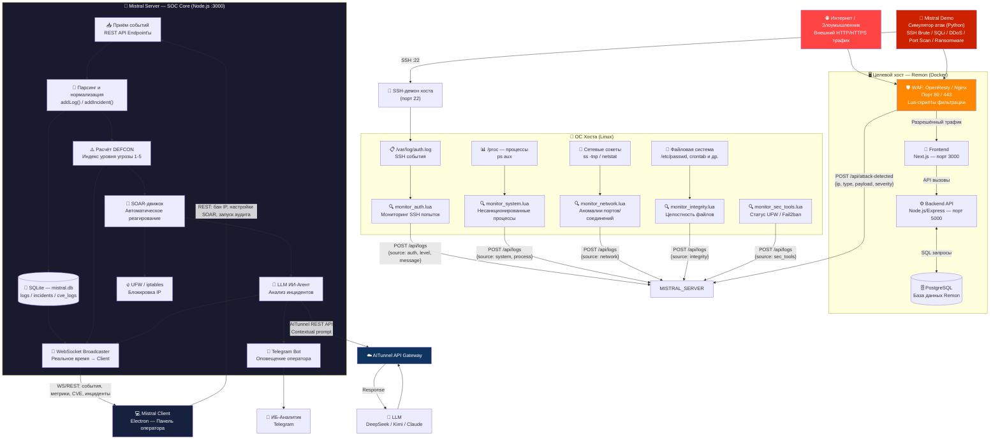
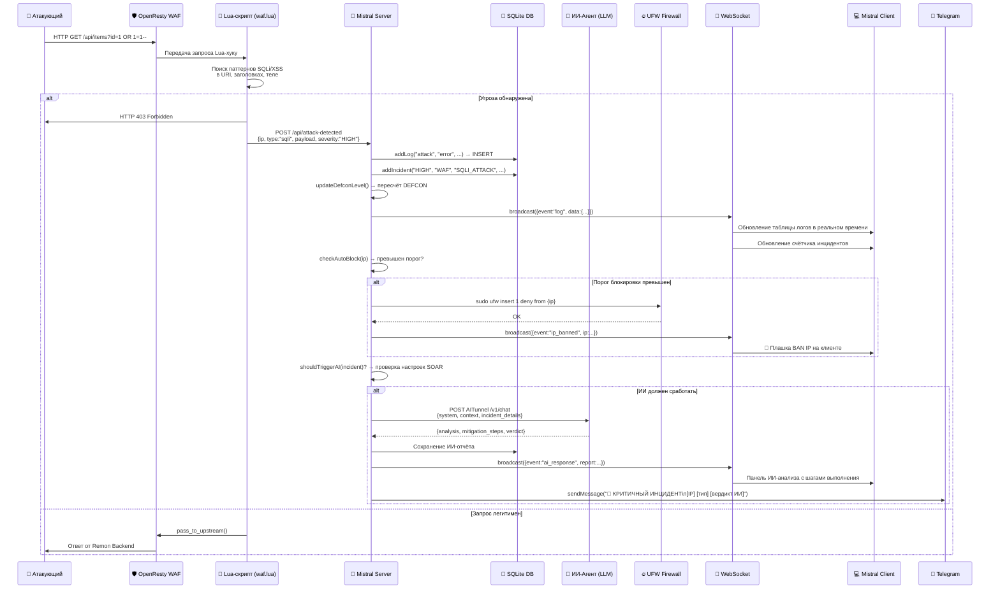
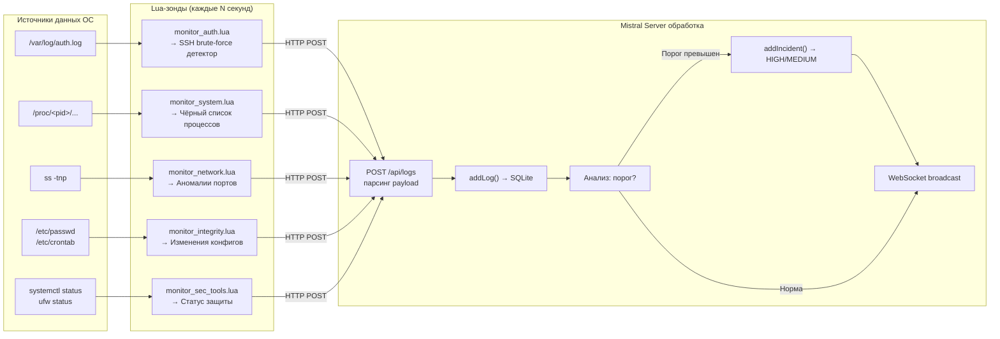
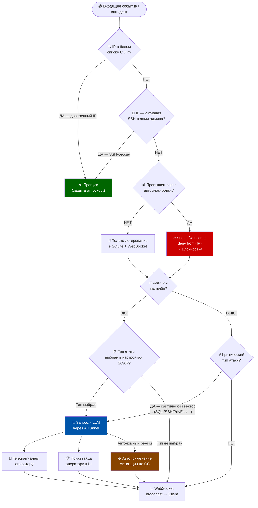
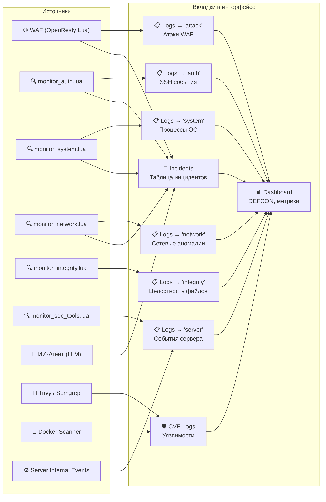

# Блок-схема потоков трафика — Mistral SOC

> Этот документ описывает **откуда поступает трафик**, **как он проходит через каждый компонент** и **как принимаются решения по реагированию**.

---

## 1. Общая карта потоков трафика

---

## 2. Детальная блок-схема: Жизненный цикл одного события атаки

---

## 3. Потоки системной телеметрии с хоста

---

## 4. Блок-схема принятия решений SOAR

---

## 5. Сетевые порты и протоколы

| Компонент | Порт | Протокол | Направление | Описание |
|---|---|---|---|---|
| OpenResty WAF (Remon) | **80 / 443** | HTTP/HTTPS | ← Внешний трафик | Точка входа всего трафика к Remon |
| Remon Frontend | **3000** | HTTP (internal) | WAF → Frontend | Next.js внутри Docker |
| Remon Backend | **5000** | HTTP (internal) | Frontend → Backend | Node.js/Express REST API |
| PostgreSQL | **5432** | TCP | Backend → DB | База данных Remon |
| Mistral Server | **3000** | HTTP + WS | Lua/WAF/Client → Server | Основной API и WebSocket SOC |
| SSH-демон | **22** | TCP | Атака / Администратор | Мониторится monitor_auth.lua |
| Telegram API | **443** | HTTPS | Server → Telegram | Вебхук оповещений |
| AITunnel API | **443** | HTTPS | Server → Cloud | Запросы к LLM |

---

## 6. Откуда берётся каждый тип лога в интерфейсе Mistral Client

---

*Документ сгенерирован для дипломной работы. Версия системы: Mistral SOC v1.4.0*
